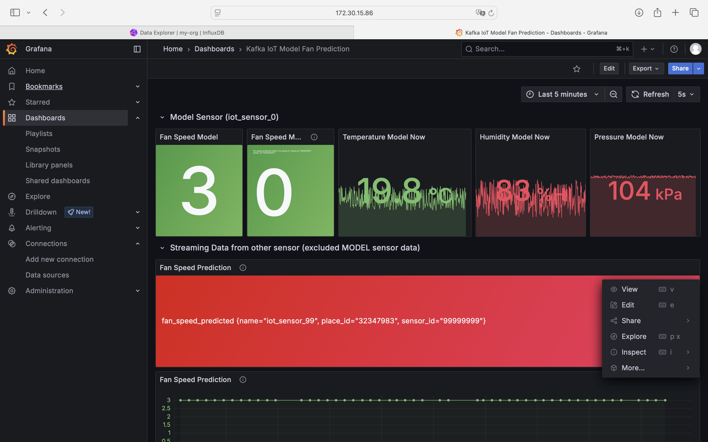

# Online Prediction
1.รับข้อมูล sensor
2.เตรียมข้อมูล (Preprocessing)
3.ส่งเข้าโมเดลเพื่อทำนาย (Inference)
4.ปรับผลลัพธ์ (Postprocessing)
5.ส่งผลกลับทันที

## ปิดการใช้งานของ Batch ML ดังนี้

1. Kafka-to-Jsonl
2. Train-form-data
3. Predict-then-influxdb

## เริ่มใช้งาน Online ML ดังนี้

1. Docker compose down batch ML
2. แก้ไฟล์ .env ใน Online-ml-predict
3. Docker compose up --build online ml

## ผลที่ได้จากการใช้ ML มีดังนี้
